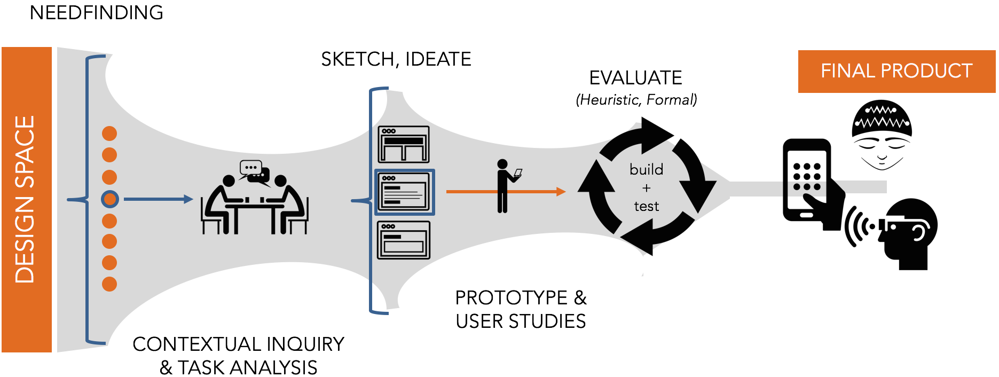

At the conclusion of each design sprint, you and your team will construct a public facing document that presents your process and outcome. This will consist of:

1. **A post on Medium.com**. You may choose to make this a private or public link. However, I am hoping to choose the 2 or 3 consensus favorite outcomes of each assignment and make them public on the [_WPI HCI_ Medium account](https://medium.com/wpi-hci).

2. Embedded in your post, **a demo video** that shows interaction with your technology, highlighting the key design decisions that you made. This will likely require you uploading your video to a public service (such as YouTube). _Note: Some of your assignments may NOT require a video. Read the instructions carefully_.

### Why do I have to do this?

In May 2017, I sat down with a design researcher from Google to talk about what they look for in job applicants. She was frustrated with the applications being sent their way - _"I just see images of the final product! I don't have any understanding of the process they used to get there. What did they do?"_

Introducing new technology at the scale of Google (_millions_ of people) is a risky proposition. Small misconceptions can go wrong very quickly. In that environment, it is critical to not only create a good product, but be able to articulate the decisions you made along the way.

This requirement is to make my Google friends happy - you will be creating public-facing design documents that accompany each of your design sprints. If you do it well, these documents are invaluable to future employers to understand the kind of employee that they will potentially hire. More importantly, it forces you to justify your own decisions within the context of people - not just program functionality.

### What should be in my design reflection?

**Start with a one-paragraph summary**. This should highlight what your design objectives were and what you created. If someone refuses to read a word of your post beyond this first paragraph, they should still have the gist of what you tried to create.

**The majority of your post should clearly walk through and reflect on the design stages that you went through to arrive at the final prototype.** At each stage, include some form of evidence - a video/photo of you testing your app with users, photos of the sketches you made to brainstorm your app context, a gif of some interaction you were testing out... anything!

By the conclusion of your post, you should have broadly addressed the following questions:

- What worked? What didn't work?
- What options did you explore?
- Why did you explore these particular options? This should, whenever possible, be grounded in theory and background readings.
- How did you test those options?
- How did you decide on the results?
- What was the final result?
- Looking at your final prototype, what are its strengths? What are its weaknesses? What would be improved upon if you had more time?

These kind of questions are frequently cited as the critical pieces that companies want to see: [here is another blog post on the topic](https://medium.freecodecamp.com/how-to-talk-about-your-side-projects-18b96f192817). In some assignments, I will explicitly ask you to focus on one step of the design process. In that case, you should

For a more concrete example, this can serve as an target for what you should shoot for (although it is longer than what you need): [_Designing Facebook Collage_](https://medium.com/facebook-design/designing-facebook-collage-304436764ca8)

**You should have a conclusion paragraph.** This wraps up and summarizes your post.

### What does a _good_ post consist of?

Writing a good post for a broad audience is **not** the same as writing a reflection or paper for a class at WPI. Carefully reflect on the content, language, and visual design of your post.

**Visually, what does a _good_ post look like?** Visit some blogs and scroll through the posts without even reading the content. Despite a lack of content, you are already making judgments about whether this wall of text is worth reading. How are you making these judgments? What is it based on?

- [Quick tips on writing a good post](https://www.integritive.com/non-writers-guide-writing-web/)

Some examples of blog posts that I believe do a nice job discussing the design process:

- [_How to design a robust chatbot interaction_](https://uxdesign.cc/how-to-design-a-robust-chatbot-interaction-8bb6dfae34fb): While this is significantly longer than your reflections need to be, notice the pacing of the article - subheadings, links, lists, quotes, images, etc.

- [_Our Product Design Process_](https://medium.com/xd-studio/our-product-design-process-9329cb3bc403): This post is image heavy, but notice how it sections a potentially long document into easily digestible chunks.

- [_Peek Inside a Facebook Design Critique_](https://medium.com/facebook-design/peek-inside-a-facebook-design-critique-c4833efda26e): While most of the content of this post is a long conversation, notice how they visual design keeps it interesting. The pacing is broken up by example images and quotes, followed by a nice summative reflection at the conclusion.  

In each of the previous posts, consider how there is never a long block of text. They are transformed into shorter, punchier paragraphs. Also notices how you never see a long string of paragraphs back-to-back. They are always broken up by subheadings, lists, or images to help readers visually parse through the information. **Your posts should do the same.** There is no reason why your work shouldn't look as professional in presentation as the ones above.

### Tips for the process

_**Document, Document, Document!**_ Take pictures, record audio, and make videos every step of the way. From early ideas all the way to final prototypes. These will be critical for writing your design documents. Note that many of these assignments from a technical perspective could be tackled individually. Part of the reason that I am forming teams is to increase the bandwidth each group has to spend on reflections like this.

While the post should be a group initiative, it is useful to identify someone in your team to document your design process ALONG THE WAY and begin writing the framework of your post. The important bit here is that you are considering your reflection through the entire design process, **not** just at the end.

_**Make every decision intentional, and justify every decision**_ For as many design choices as possible, state what you chose to do and why you chose to do it that way. How did user testing guide your final decisions? How did design theory affect them? Did you use ideas from background readings? When you can cite prior literature and design artifacts in your justifactions they become less subjective and more likely to be considered valid. Not all of the time (you can find some pretty crazy prior work out there, but much of the time.

-----------

## Demo Video

The interactions that you build will break over time, but demo videos last forever. In that spirit, somewhere in your design post, you should have a demo video that that demonstrates the core interactions of your interface. By the end of the video, it should be clear what the primary functions of your app are. **In most cases, these videos should last no more than 1 minute.**

### What is a _good_ video?

Good videos have good visuals and good sound. The advice seems obvious, but the number of submissions that I see every year with blurry input and the soundscape of a wind tunnel tells me that these ideas need to be reinforced.

Decide whether you want to use music, captions, narrative or some kind of combination of them. For the love of god, don't create a silent demo video. Below, you'll find some nice resources for music that you can include as a backdrop to your product.

- [_How to Create Your First Product Demo Video as a Total Newbie_](https://www.process.st/product-demo-video/): You might not necessarily use the same tech in the article, but many of the principles remain.

**Good Examples:**

- [_Clear for iPhone_](https://www.youtube.com/watch?v=S00H-rz7fGo)
- [_Orchestra unveils Mailbox_](https://www.youtube.com/watch?v=_Us1Ws4i14c)
- [_Facebook Messenger Chat with Bot Demo_](https://www.youtube.com/watch?v=_Kk3AbP3SI0)

Somewhere in your design post, a demo video should be embedded that shows interaction with your final project.

### Multimedia for your Videos
Since our intention is to be able to broadly share these videos, it is important that we take into account copyright considerations. The following is a list of royalty-free high quality resources for you to use. _We will be updating this list throughout the term._
- [Unsplash:](https://unsplash.com/) you can find high-resolution royalty-free photos here.
- [FreeSound:](https://freesound.org/) has a lot of royalty-free audio, although you will need to make an account.
- [OpenGameArt:](https://opengameart.org/) features assets of all kinds including sound and visuals, just be sure to check the licensing for the particular piece you intend to use!
- **More to come.**

### Recording your Video
Your video should be as high quality as possible. For many of your screen-based products, you'll want some kind of screen-capturing software.

- **On Mac:** _QuickTime_ has built-in screen capture software that will record any activity on the screen. There are other options, but this is likely the most simple.
- **On Windows:** There are a number of free options on Windows - [many of which can be explored in this article](http://www.techradar.com/news/the-best-free-screen-recorder)

### Video Editors
You'll also need a decent video editor to put together sight and sound.

- **On Mac:** _iMovie_ is probably your best bet. It provides a very easy drag-and-drop interface to import music, videos, and images, as well as create basic annotations (titles).
- **On Windows:** Most of the computers in Fuller and Higgins labs are outfitted with _Camtasia_ and _Adobe Premier_, both of which are great video editors with built in screen recorders. [_VSDC_](http://www.videosoftdev.com/free-video-editor) is great if you are looking for a non-commercial piece of software (just be sure to save your work often), and there are plenty of Windows Store apps and Google Chrome extensions that will work in a pinch.

-----------------

## How will this be assessed?
You will be assessed in 3 different ways.

- Most significantly, you will be assessed by me using the [following design document rubric](designdoc_rubric.pdf). **Please read through this carefully!** Note that functionality is actually a small portion of your grade. Documentation and reflection of your design process is weighted heavily. I will either email you my feedback or discuss it in-person with your group during class.

- Each design sprint will include a demo day in which students will be assigned to give feedback to other groups. For that, we will use the _I like, I wish, What if_ that is common in Stanford's Design School. I will send your group the feedback from other students. A Google Form link will be posted in Slack.

- Finally, in separate Google Form, you will fill out group feedback using the same _I like, I wish, What if_ framework.
