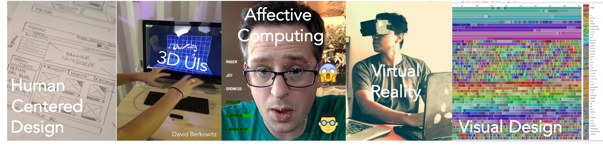

---
# You don't need to edit this file, it's empty on purpose.
# Edit theme's home layout instead if you wanna make some changes
# See: https://jekyllrb.com/docs/themes/#overriding-theme-defaults
layout: home
---

<!--
For computer scientists, the word _design_ is too often used exclusively in the context of code and architecture. The result of this narrow perspective is that engineers have a habit of building complex, intricate products that are wonderfully functional, but never used. When they _are_ used, neglecting people in your design can lead to unexpected consequences that range from clumsiness to discrimination for individuals, groups, or cultures.

In this course, we will study both people and technology to  understand the behavior that computers encourage or constrain. Through a variety of modalities (3D user interfaces, visualization, coding playgrounds, etc), we will deliberately practice processes that result in useful, usable, and maybe even inspirational computer interfaces. 
-->
## Why the _Human_ is first in Human-Computer Interaction
For computer scientists, the word _design_ is too often used exclusively in the context of code and architecture. The result of this narrow perspective is that engineers have a habit of building complex, intricate products that are wonderfully functional, but never used. When they _are_ used, neglecting people in your design can lead to unexpected consequences that range from clumsiness to discrimination for individuals, groups, or cultures.

In this course, we will study both people and technology to  understand the behavior that computers encourage or constrain. Through a variety of modalities (3D user interfaces, visualization, coding playgrounds, etc), we will deliberately practice processes that result in useful, usable, and maybe even inspirational computer interfaces.  

- **Who:** Prof. [Charlie Roberts](http://charlie-roberts.com)
- **Where:** Salisbury Labs, 402 
- **When:** 6:00–7:50, T-Th
- **Teaching Assistants:** Joshua Bloom & Erden Oktay
- **Email Contact**: [cs3041-staff@cs.wpi.edu](mailto:cs3041-staff@cs.wpi.edu)

## Resources
<!-- 
**[Availability Matrix for ALL projects (see bottom tabs)](https://docs.google.com/spreadsheets/d/1XP1acIxYnwktZnutnE5nyHl2-kfNOfGkjPqyZFTDWWM/edit#gid=1483891469)  
**[Reading Feedback Form](https://goo.gl/forms/9YribW48cQJjZiS42)**
- [Design Feedback Form](https://goo.gl/forms/OuwJuS3ELupkHFgy2)
- [Team Reflection Form](https://goo.gl/forms/4vpDLMoqeSCxr5LF2)
-->

- [Course Syllabus](docs/syllabus.html)
- [Reading Schedule](docs/schedule.html)
- [Design Doc Instructions](docs/designdocs.html)
- [Slack Group](https://cs3041-18b.slack.com/) \| [Join](https://join.slack.com/t/cs3041-18b/shared_invite/enQtNDYzMzcxNDMyNTAyLWJhYzIwZTAxMTVkNDc1NzcxYTViNjc2NDNhMTQ4MmM2MmNiZGZjN2Q0OTI3ZjA2MjQ3ODMzZWUyODczODYwNjE)
- [Design Resources](docs/resources.html)

## Designing
_For examples of student work, see the [CSCI379 publication](https://medium.com/bucknell-hci/tagged/csci379-hci) page at [Bucknell HCI's Medium](https://medium.com/bucknell-hci)_

- [Good Design, Bad Design](designs/goodbad_assn.html) **->** [submit](https://docs.google.com/spreadsheets/d/1_-c52ou3mpTM-5WZWA72Un6ohm9ZPpca2NkV5ujLrBU/edit?usp=sharing) \| _Due 10/25, 5:59 PM_
- [Design for Others](designs/visual_assn.html) **->** [submit](https://docs.google.com/spreadsheets/d/1U7gsWmazuKwDc3-ymrrKCwq4MaXGi1rNR3teIy_9iKU/edit?usp=sharing) \| _Due 11/8, 5:59 PM_
- [Design for Understanding](designs/datavis_assn.html) **->** 
  - _Initial Prototype Due 11/13, 5:59 PM_
  - _Final Prototype Due 11/15, 5:59 PM_
  - _Design Reflection Due 11/20, 11:59 PM_ [submit](https://docs.google.com/spreadsheets/d/18tzLR-S5XDisACe8jqp5Np2siVxnO0ZoQW2byGuy5SA/edit?usp=sharing)
- [Design for Tension](designs/chatbot_assn.html) **->** 
  - _Final Prototype Due 11/27, 5:59 PM_
  - _Design Reflection Due 11/29, 5:59 PM_ [submit](https://docs.google.com/spreadsheets/d/1zGi6VPkb5ympAJKXf3lOZkUys8JP-CM68rx8YjLC6pQ/edit?usp=sharing)
- [Design for Wellbeing](designs/emotion_assn.html) **->** 
  - _Final Prototype Due 12/4, 5:59 PM_
  - _Design Reflection Due 12/6, 5:59 PM_ [submit](https://docs.google.com/spreadsheets/d/1RpuIJYlHO48eitI6_wFl1ue-eHDES5EnkC9fUxvFW90/edit?usp=sharing)

<!-- 
- [Design for Others](designs/visual_assn.html) **->** [submit](https://docs.google.com/spreadsheets/d/1JV-dlcXFRXPoh-2ms8BZEtR_dzpDk8Sa-sTBIVfgzcU/edit#gid=304752249) \| _Demo 3/23_ \| _Doc 3/26, 11:59 PM_
- [Design for Understanding](designs/datavis_assn.html) **->** [submit](https://docs.google.com/spreadsheets/d/1JV-dlcXFRXPoh-2ms8BZEtR_dzpDk8Sa-sTBIVfgzcU/edit#gid=711832985) \| _Demo 4/2_ \| _Doc 4/3, 11:59 PM_
- [Design for Tension](designs/chatbot_assn.html) **->** [submit](https://docs.google.com/spreadsheets/d/1JV-dlcXFRXPoh-2ms8BZEtR_dzpDk8Sa-sTBIVfgzcU/edit#gid=1873200654) \| _Demo 4/9_ \| _Doc 4/10 , 11:59 PM_
- ~~[Design for Fun](designs/gesture_assn.html) **->** [submit](#) \| _Demo 4/13_ \| _Doc 4/16, 11:59 PM_~~
- [Design for Wellbeing](designs/emotion_assn.html) **->** [submit](https://docs.google.com/spreadsheets/d/1JV-dlcXFRXPoh-2ms8BZEtR_dzpDk8Sa-sTBIVfgzcU/edit#gid=220366641) \| _Demo 4/19_ \| _Doc 4/23, 11:59 PM_
- [Design for Another World](designs/vr_assn.html) **->** [submit](https://docs.google.com/spreadsheets/d/1JV-dlcXFRXPoh-2ms8BZEtR_dzpDk8Sa-sTBIVfgzcU/edit#gid=175718970) \| _Demo 4/27_ \| _Doc 4/30, 11:59 PM_
**Final Project (Individual):** [Design Manifesto](docs/manifesto.html) \| _At the beginning of the last day of class_ **->** [submit](https://docs.google.com/spreadsheets/d/1JV-dlcXFRXPoh-2ms8BZEtR_dzpDk8Sa-sTBIVfgzcU/edit#gid=667431766)
-->

## Attribution
This course is adapted from Prof. Lane Harrison's class at WPI, which was in turn adapted from Prof. Evan Peck's HCI course at Bucknell University. Thanks to Lane & Evan for making these materials available!
